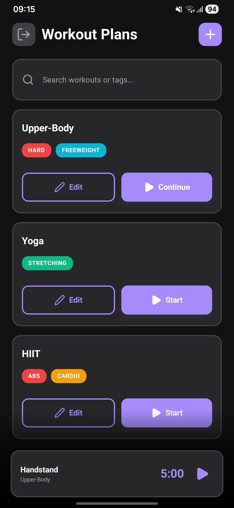
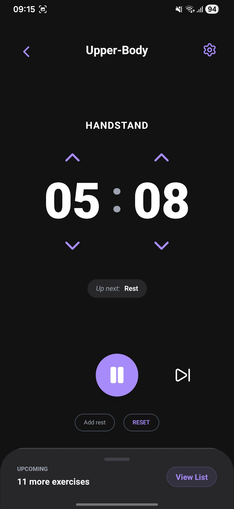

# Mobile Application Development — Project Work

> **Project Topic:** Workout Timer Application
> **Framework:** Expo React Native

---




---

## 🚀 Launching the Project (Local Execution)

### Prerequisites

> **TypeScript** for type safety
> **NativeWind (Tailwind CSS)** for styling
> **Expo Router** for file-based navigation
> **Expo SQLite** for local database management
> **Jest & React Native Testing Library** for testing

### Installation and Setup
```bash
git clone assignment-B-arney
cd Mobil_Alkalmazasfejlesztes
npm install
npm run android
```

---

## 📱 Download / Installation
- **APK Download:** The APK version of the application (Android) will be available via the [Releases](https://github.com/b-arney/WorkoutTimer/releases) page.
- GitHub Release steps:
1. `eas build -p android --profile preview`
2. Uploading the generated APK to the latest GitHub Release.

## 🧪 E2E Testing and Authentication

The project utilizes Detox-based End-to-End (E2E) tests for the login and workout creation workflows.

### Running E2E Tests (Locally)

1. Ensure that the Android Emulator is running or that you have a connected device (`adb devices`).
2. Run the test script:
```bash
npm run e2e
```
This will compile the application as an `android.emu.debug` build and then launch the tests on the configured emulator.

### Authentication

Firebase Auth-based login is integrated into the system. Registration or login is required to view the "Workout Plans" page and to create workout routines. The app automatically redirects to `auth/login` if no user is authenticated.

